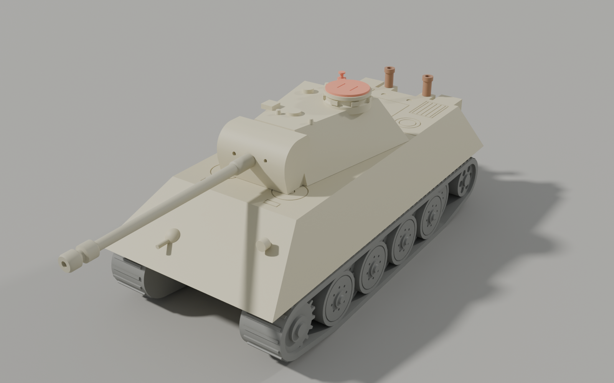
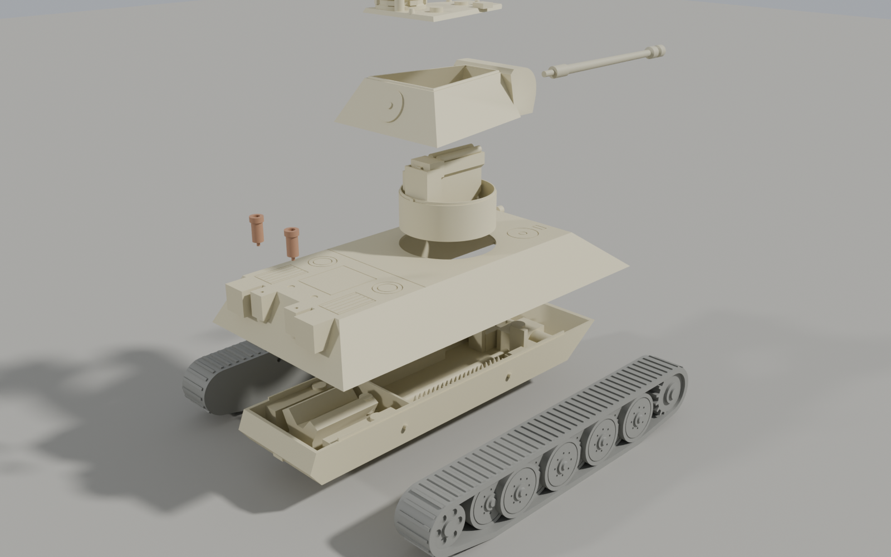
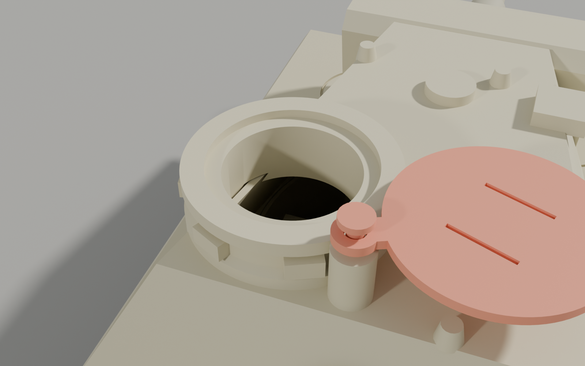
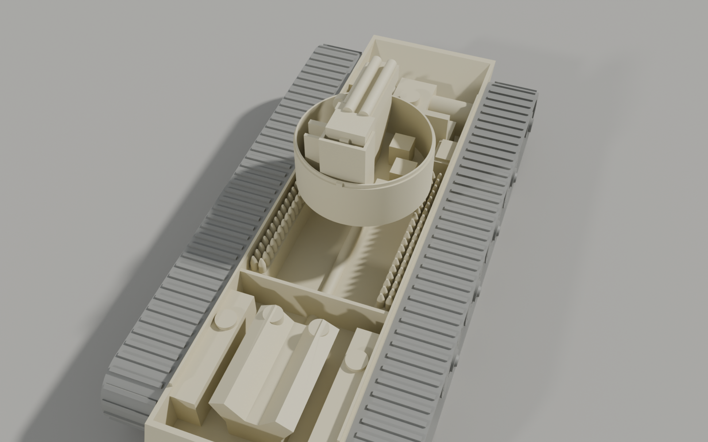
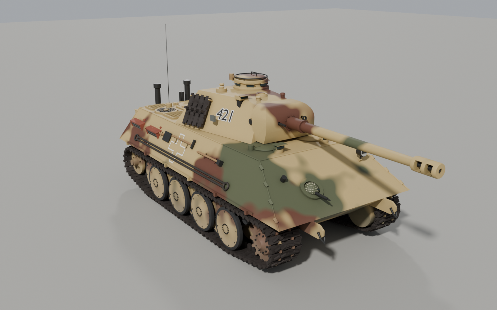
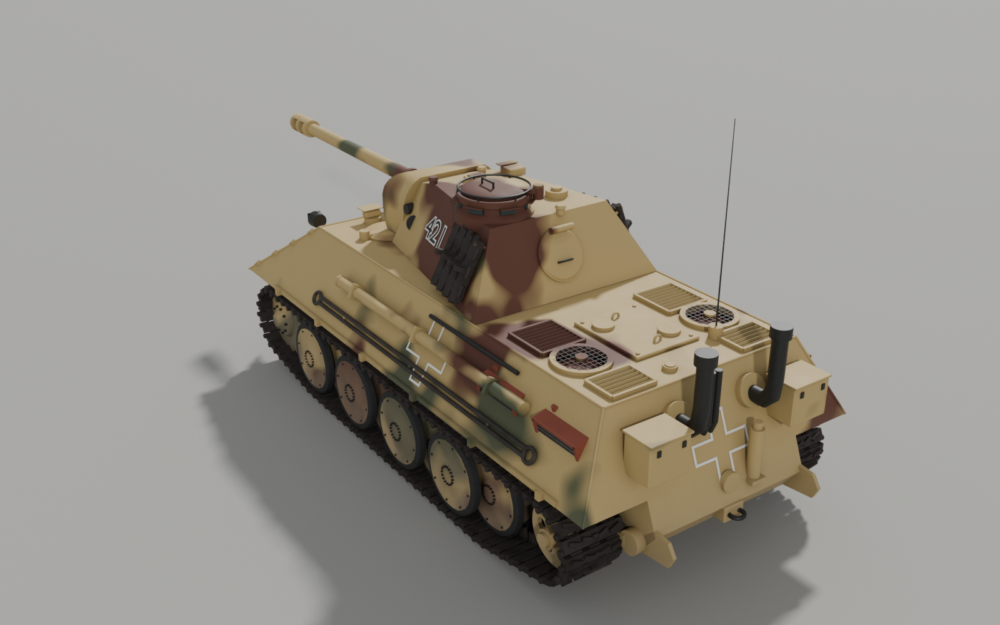
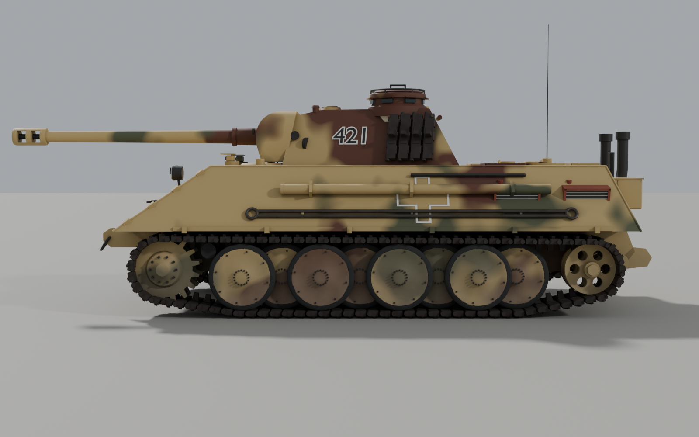
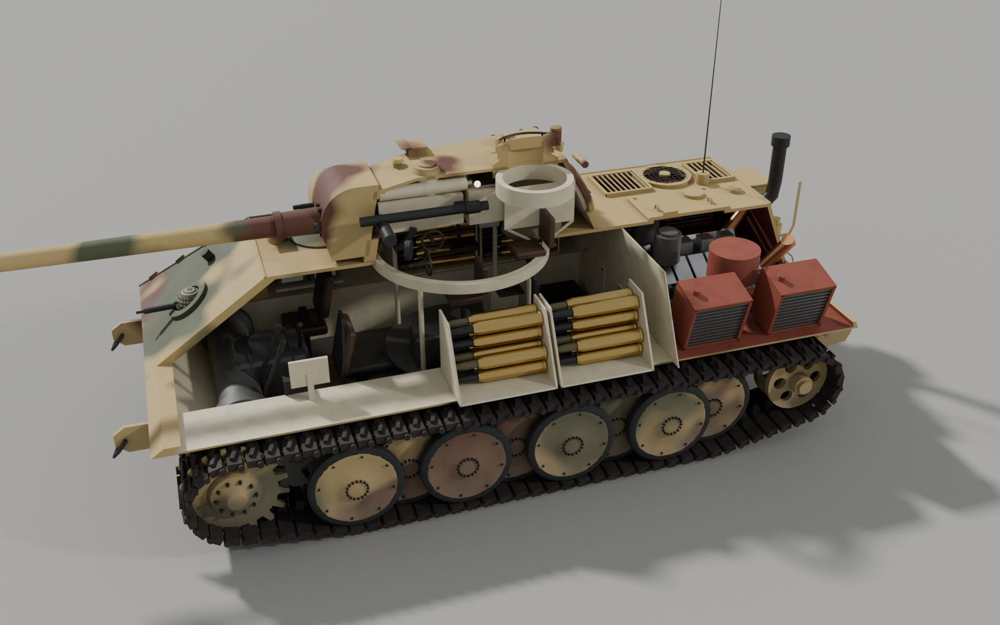
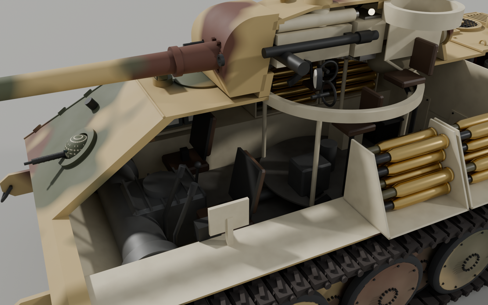
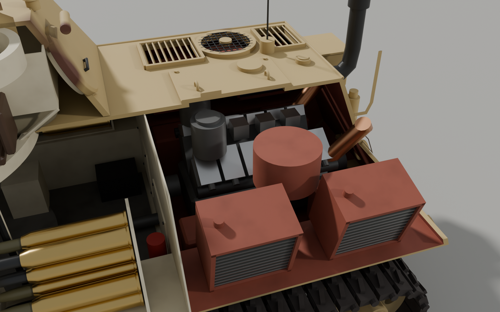

# Panther Ausf. G (Pz.Kpfw. V) — print kit + detailed Blender model

Two models of the late-war German Panther Ausf. G, both generated by Blender Python scripts
so they can be rebuilt or rescaled:

| Deliverable | File | What it is |
|---|---|---|
| 3D-print kit (1:35) | `print_1-35/*.stl` | 12 watertight parts with a simplified exterior **and interior**, and **one working hatch** (commander's cupola) |
| Print reference scene | `panther_print_1-35.blend` | All print parts assembled at real scale |
| Detailed model | `panther_ausf_g_detailed.blend` | High-detail exterior + full interior, camouflage, markings, rigged hatches/turret/gun, cutaway |
| Previews | `renders/*.png` | Renders of both models |
| Sources | `scripts/` | `pz_geom.py` (shared dimensions + geometry), `build_panther_print.py`, `build_panther_detailed.py`, `render_views.py` |

Reference data used (Ausf. G): hull 6.87 m, 8.66 m with gun, 3.27 m wide, 2.99 m high,
660 mm tracks, 8 interleaved 860 mm road wheels per side, 1.65 m turret ring, 75 mm KwK 42 L/70,
glacis 80 mm @ 55°, hull sides 50 mm @ 29°, turret front 110 mm, sides 45 mm @ 25°.

---

## 1. Print kit (1:35)

Assembled size: **196 mm hull, 247 mm with gun, 93 mm wide, ~86 mm high**.
Every part fits on a 220 × 220 mm bed.




### Parts

| # | STL | Print orientation (already set in the file) | Supports |
|---|---|---|---|
| 1 | `hull_lower` | floor on the bed | **yes**, under the sloped lower nose only (build plate only) |
| 2 | `hull_upper` | roof on the bed (upside down) | **yes**, under the glacis only (build plate only) |
| 3 | `running_gear_left` | inner face on the bed | no |
| 4 | `running_gear_right` | inner face on the bed | no |
| 5 | `turret_body` | upright, chin mantlet sits on the bed | no |
| 6 | `turret_roof` | upright (cupola up) | no |
| 7 | `turret_basket` | upright (floor on the bed) | no |
| 8 | `hatch` | top face on the bed | no |
| 9 | `hatch_pin` | head on the bed (optional: a 6 mm piece of 1.75 mm filament works too) | no |
| 10 | `gun_barrel` | vertical, muzzle brake down; add a brim | no |
| 11–12 | `exhaust_left/right` | top end on the bed | no |

The build checks every part automatically (`print_1-35/build_report.txt`): no non-manifold edges,
one shell per part, and a list of overhangs steeper than 45°. Apart from the two sloped nose
plates, the only overhangs are short bridges (engraving floors, peg holes).
All assembled parts were also intersected against each other; the overlap is zero everywhere.

**Suggested settings (FDM, PLA):** 0.4 mm nozzle, 0.12–0.16 mm layers, 3 walls, 15 % infill.
Walls are 1.6 mm and the smallest details are about 0.8 mm. Resin printers work too:
hollow the hull parts and add drain holes.

### Fits and clearances (in mm, independent of scale)

| Joint | Clearance |
|---|---|
| Hull lower lip → groove in upper hull (lift-off, no glue) | 0.2 |
| Running-gear pegs Ø2.5 → holes | 0.2 + 0.05 |
| Turret basket tube → hull roof ring (turret rotates) | 0.3 radial |
| Basket spigot → turret ring plate (glued, keyed) | 0.1 |
| Turret roof groove → wall lip | 0.2 |
| Barrel peg Ø3.1 → mantlet socket | 0.2 |
| Hatch plug → cupola seat | 0.2 |
| Hatch arm → pin | 0.2 (the pin is a snug fit in the cupola boss) |

### Assembly

1. **Hull:** push the two running-gear sides onto the pegs on the lower hull (glue optional).
   Set the upper hull on top: the lips on the side walls register it. Leave it unglued so it lifts off
   to show the interior: driver and radio-operator stations with steering levers, gearbox and
   steering unit, radio rack, propeller shaft, ammunition racks, firewall, V12 engine, radiators.
2. Glue the two exhausts into the sockets on the rear deck.
3. **Turret:** glue the roof onto the turret body (lip and groove). Turn the turret over and slide
   the **basket in from below** through the ring plate: the key rib goes into the notch at the rear,
   and the shoulder glues against the underside of the plate. Push the barrel into the mantlet.
4. Drop the turret into the hull roof ring. It rotates freely, and the basket (gun breech,
   deflector guard, gunner/commander/loader seats, traverse gear) turns with it.
5. **The hatch:** press the pin (or filament) into the boss beside the cupola, put the hatch arm over
   it and lower the hatch into its seat. To open it, **lift the hatch about 1 mm and swing it sideways**
   (the real Panther's lift-and-swing cupola hatch works the same way). The 14 mm opening looks down
   onto the commander's seat.




### Other scales

```
blender -b --factory-startup --python panther/scripts/build_panther_print.py -- --scale 25
```
This writes `print_1-25/` and `panther_print_1-25.blend`. Wall thicknesses and clearances stay in
millimetres, so fits keep working at any scale. At 1:25 the hull parts are 275 mm long, so they need a bed of about 300 mm.

---

## 2. Detailed Blender model

`panther_ausf_g_detailed.blend` (Blender 5.2; about 120 k vertices, 28 materials, Cycles scene ready).








**Exterior.** The hull is built from armour plates at their real thicknesses, with weld seams and the
interlocked glacis/side-plate joints. Also modelled:
- Bow MG 34 in its Kugelblende 50 ball mount, Bosch headlight, rotating driver/radio-operator periscopes.
- Towing lugs with shackles, the rear towing pintle, the jack and the Notek light.
- Engine deck: armoured louvre grilles, mesh fan covers, engine access hatch, fuel fillers, Fu 5 antenna.
- Exhausts with armoured collars and cooling tubes, rear stowage bins.
- Tow cables, cleaning-rod tube, shovel, axe, sledgehammer and crowbar, Schürzen rails.
- Running gear: 8 interleaved double road wheels per side (rubber tyres, hub and rim bolts),
  torsion arms, 17-tooth sprockets on final-drive housings, cast idlers with lightening holes,
  return rollers, and **2 × 87 individual track links** (grousers, hinge knuckles, guide horns).
- Turret: sloped front roof, chin ("Kinn") mantlet, KwK 42 L/70 with double-baffle muzzle brake,
  cast cupola with 7 periscopes and the AA MG ring, loader periscope, ventilator,
  close-defence weapon, crane sockets ("Pilze"), rear escape hatch, spare track links.
- Markings: late-war outline Balkenkreuz and the turret number "421".

**Interior** (ivory "Elfenbein" crew compartment, red-oxide engine bay):
- Driver station: seat, steering levers, pedals, instrument panel, gyro compass.
- Radio operator station: MG 34 with ammunition bag, Fu 5 radio sets, intercom.
- AK 7-200 gearbox with steering unit and brake drums, propeller shaft.
- 40 rounds of 75 mm ammunition (AP and HE) in the sponson racks.
- Turret basket with hydraulic traverse unit, turret-ring race with gear teeth.
- Gun breech with sliding block, recoil cylinders, deflector guard with case bag,
  TZF 12a sight, coaxial MG 34, elevation arc.
- Gunner seat with handwheels and azimuth indicator, raised commander seat, folding loader seat.
- Firewall, Maybach HL 230 P30 V12 (heads, carburettors, air cleaners, exhaust manifolds),
  finned radiators, cooling fans and fuel tanks.

### Controls

Select **`Panther_Controls`** (the sphere above the tank) and change its custom properties
(Object properties → Custom Properties). Drivers apply the changes:

| Property | Effect |
|---|---|
| `turret_traverse` | turret rotation in degrees |
| `gun_elevation` | −8° … +18° |
| `cupola_hatch`, `driver_hatch`, `radio_hatch`, `turret_rear_hatch` | 0 = closed … 1 = open (hull and cupola hatches lift, then swing) |
| `cutaway` | 1 = cut the left side away to show the interior |
| `skirts` | 1 = show the Schürzen side skirts |

Collections: `Exterior`, `Running_gear`, `Turret`, `Interior`, `Markings`, `Optional` (skirts), `Rig`.
The camouflage (Dunkelgelb / Olivgrün / Rotbraun, dust, crevice darkening) is procedural and
follows the hull and turret, so it stays in place when the turret rotates.

---

## 3. Photoreal forest render


`scripts/render_forest.py` places the detailed tank in a sunlit German pine forest and renders it with
Cycles. The clean model file is left untouched; the scene is saved as `panther_forest_scene.blend`.

- **Environment:** `forest_slope` 8K HDRI (a pine forest in Saxon Switzerland, Germany). A sun lamp is
  aligned automatically with the HDRI's own sun for crisp, dappled canopy shadows, and a light haze
  volume adds aerial perspective and light shafts.
- **Ground:** real displaced forest floor using adaptive subdivision (needle and leaf litter mixed
  with churned mud around the tank), plus the tank's own ruts curving back into the forest, with
  grouser imprints every 156 mm and pushed-up rims.
- **Vegetation:**
  - About 170 Scots pines and firs: full-detail LOD0 within 26 m of the camera, LOD1 further out.
  - Young trees, saplings, stumps, a fallen trunk, root clusters and mossy rocks.
  - Grass, ferns and nettles scattered with Geometry Nodes from a density map that keeps the tank,
    the ruts and the camera's sight line clear.
- **Tank weathering** (render scene only): faded paint, dust on horizontal surfaces, rain streaks,
  mud splatter rising from the running gear, and chipped edges showing primer and steel.
- **Render:** Cycles on the GPU (OptiX), 1024 adaptive samples, OIDN denoising with
  albedo/normal passes, path guiding, AgX colour, 42 mm lens at f/4 depth of field, 3840 × 2160.

```
python panther/scripts/fetch_forest_assets.py        # once, ~2.2 GB of CC0 assets from polyhaven.com
blender -b panther/panther_ausf_g_detailed.blend --python panther/scripts/render_forest.py -- --camera hero
    # options: --camera hero|low|rear  --res 3840x2160  --samples 1024  --preview  --no-render
```

All environment assets are CC0 from [Poly Haven](https://polyhaven.com). They are downloaded into
`forest_assets/`, which is git-ignored.

---

## Rebuilding

```
blender -b --factory-startup --python panther/scripts/build_panther_detailed.py
blender -b --factory-startup --python panther/scripts/build_panther_print.py -- --scale 35
blender -b panther/panther_print_1-35.blend      --python panther/scripts/render_views.py -- print
blender -b panther/panther_ausf_g_detailed.blend --python panther/scripts/render_views.py -- detailed
```

## Notes and simplifications

- Dimensions come from published overall figures and armour data, not factory drawings.
  Hidden proportions (compartment layout, exact wheel spacing) are close approximations.
  The modelled track pitch is 156 mm (real 153 mm) so that 87 links close the loop.
- The print kit merges each road-wheel pair into one disc, fills the sponsons solid (their
  interior would need supports), and leaves the side tools off.
  The deflector guard is shortened so it stays on the basket floor.
- The hull machine-gun ball and the headlight are on the glacis, so they print inside the
  glacis support zone.
